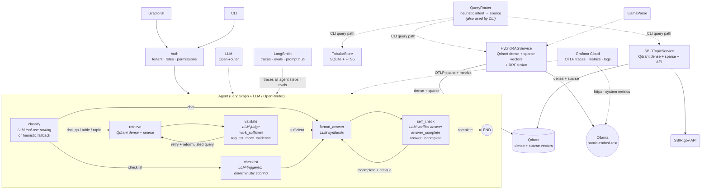

# GovGrant AI


**A compliance assistant for U.S. federal SBIR/STTR grant proposals.**

GovGrant AI answers questions about agency regulations (DoD/DARPA, SBA, NIH SF424) using multimodal RAG over text, tables, and figures, orchestrated by a LangGraph agent with Claude Haiku. It also runs compliance checklists against the source corpus and scores proposal drafts against each agency's requirements.

[The problem](#the-problem) · [Architecture](#architecture) · [Quick start](#quick-start) · [Project layout](#project-layout) · [Quality gates](#quality-gates) · [Auth & multi-tenancy](#dev-auth--multi-tenant)

---

## The problem

SBIR/STTR compliance failures rarely come from not knowing the rules — they come from
missing the one clause, threshold, or cross-reference buried in a 40-page agency
instruction document. A proposal can get desk-rejected over a work-share percentage
that's off by a few points, or a budget line that violates a cost cap stated once, in
a footnote, in a different document than the one the applicant was reading.

That failure mode has two distinct causes, and each one rules out a simpler solution:

- **Retrieval alone isn't enough.** Compliance text mixes prose ("what does the
  work-share policy say?") with exact codes and clauses (`2 CFR 200`, `SF-424`, `40%`)
  that must be matched verbatim, not approximately — a purely semantic search can
  return a plausible-sounding paragraph that isn't the one containing the actual rule.
  This is why the system uses **hybrid dense + sparse retrieval** rather than a single
  vector index (see [Why hybrid RAG](#why-hybrid-rag-dense--sparse--multimodal) below).

- **A single retrieval pass isn't enough either.** A real compliance question often
  spans more than one source — the indexed regulation corpus, a structured budget
  table, and live SBIR.gov topic data — and the first retrieval attempt doesn't always
  return sufficient evidence. Answering anyway, using whatever was retrieved, is how
  compliance tools produce confident-sounding but wrong answers. This is why the system
  needs an **agent**: something that decides which source to query, judges whether the
  evidence actually supports an answer, reformulates and retries when it doesn't, and
  checks its own final answer against the original question before returning it (see
  [Why an agent](#why-an-agent-langgraph) below).

**Why the combination matters, not just the parts:** hybrid RAG without an agent would
return the best evidence found on the first try, even when that evidence is incomplete
or from the wrong document — silently risky in a compliance context. An agent without
hybrid RAG would have decision-making and control flow, but no reliable way to ground
that decision-making in the exact regulatory text — a hallucination risk in a domain
where the exact wording is the whole point. Combining them means the agent decides
*where* and *when* to look and *whether* to keep looking, but never fabricates content
— every claim in the final answer has to trace back to retrieved, citable evidence.

The goal is narrow and concrete: **reduce the chance that an applicant submits an SBIR/STTR
proposal with an undetected compliance error** — a miscalculated work-share requirement,
a misquoted budget threshold, a missed agency-specific clause — because they trusted an
answer that sounded authoritative but wasn't actually checked against the source document.

## Architecture



### Why hybrid RAG (dense + sparse + multimodal)

SBIR/STTR compliance documents mix two search modes that no single retriever handles well:

| Mode | Example query | Solved by |
|---|---|---|
| Semantic | "What does the work-share policy say?" | Dense vectors — meaning, synonyms, paraphrase |
| Lexical | `2 CFR 200`, `SF-424`, `40%`, `5500.7` | Sparse vectors (native Qdrant) — guaranteed recall on codes and clauses |
| Multimodal | Tables, figures, flowcharts | Modality-specific parser and indexing path |

### Why an agent (LangGraph)

Plain RAG can't orchestrate multi-step decisions. The agent structures every response with LLM-driven tool-calling at each stage:

1. **classify** — LLM selects a retrieval tool via function-calling (`search_documents`, `search_tables`, `search_sbir_topics`, `cross_check`, `compliance_checklist`). Heuristic fallback when the LLM is unavailable.
2. **retrieve** — hybrid RAG (Qdrant dense + sparse vectors) + neighbor page expansion + force-include pages with exact phrase matches.
3. **validate** — LLM judge using `mark_sufficient` / `request_more_evidence(reason, suggested_query)` tools. If evidence is insufficient, the LLM reformulates the query and retries (up to 2 times) instead of using hardcoded string-matching heuristics.
4. **format_answer** — LLM synthesizes an answer grounded in the retrieved evidence.
5. **self_check** — LLM verifies the answer covers every sub-question using `answer_complete` / `answer_incomplete(critique)`. If incomplete, loops back to `format_answer` with specific revision guidance before returning to the user.
6. **checklist** — When the user asks for a compliance audit, the LLM selects which agency packages (DARPA, SBA, SF424) to check and dynamically triggers the compliance checklist; the scoring itself stays deterministic (keyword-coverage against a fixed 27-item corpus) so results stay reproducible and auditable, then the LLM interprets the results for the user.

Every decision point uses real tool-calling (not regex or keyword heuristics) — routing source selection, evidence sufficiency, query reformulation, answer quality, and checklist planning. The one deliberate exception is the checklist's internal scoring, which stays deterministic on purpose: in a compliance domain, reproducibility of the audit itself matters more than letting the model improvise it.

### Architecture notes: multi-tenancy and concurrency

**Multi-tenancy is enforced at the storage layer, not just the app layer.** Every
Qdrant query builds a mandatory `tenant_id` metadata filter before it runs — a
tenant cannot see another tenant's vectors even if application-layer auth were
bypassed, because the filter is baked into the retrieval call itself, not applied
as a post-hoc check on returned results:

```python
filters = [MetadataFilter(key="tenant_id", value=tenant_id, operator=FilterOperator.EQ)]
if doc_id:
    filters.append(MetadataFilter(key="gg_doc_id", value=doc_id, operator=FilterOperator.EQ))
```

This is defense in depth on top of the `AuthContext` allow-list layer (`auth/context.py`):
even if a caller manipulated `doc_id`, the Qdrant filter and the `allowed_doc_ids` /
`public_doc_ids` check both have to agree before a document is served.

**Concurrency is handled where it's actually needed, and left as a known boundary
where it isn't yet.** Ingest and delete both mutate an in-memory page index
(`_by_page`) used for neighbor-page expansion; that mutation is guarded by a
`threading.Lock` so concurrent ingests can't corrupt it, and Qdrant deletes use
`wait=True` so a delete is visible to the next query immediately, not eventually.
The SQLite-backed stores (`proposals`, `tabular`) currently run on SQLite's default
journal mode rather than WAL — safe for the current usage pattern (low write
concurrency, read-heavy), but a deliberate scaling boundary: high concurrent
write load would serialize there before it would anywhere else in the stack.
Flagging it here rather than glossing over it, since it's the honest next
bottleneck if usage grows.

### Why LlamaIndex + LangGraph, specifically (not one or the other)

The two libraries solve different layers of the problem, and using one instead of
both would have meant reimplementing the other's job by hand:

- **LlamaIndex owns the data layer**: chunking strategy (`HierarchicalNodeParser`),
  embedding, hybrid dense+sparse indexing into Qdrant, and metadata-filtered
  retrieval. This is roughly ~400 lines of infrastructure code that LlamaIndex
  provides as a few configuration calls instead.
- **LangGraph owns the control-flow layer**: what to do with that data once
  retrieved — which source to query, whether the evidence is sufficient, when to
  retry, when to stop. This is state and branching logic, not indexing logic, and
  LlamaIndex has no primitive for it (nor should it — it's not a data library's job).

Using LlamaIndex for control flow would mean bolting ad-hoc branching onto a data
library not built for it. Using LangGraph for retrieval would mean reimplementing
hierarchical chunking and hybrid fusion by hand. Keeping them separate — LlamaIndex
as a tool the agent calls, not a framework the agent lives inside — keeps each
piece testable and replaceable on its own: the retrieval layer could be swapped
for a different vector store without touching the agent's decision logic, and vice
versa. `StateGraph.add_conditional_edges` enables the retry/branching loops in the
diagram above without any bespoke orchestration code.

## Data sources

The `QueryRouter` doesn't send every query to the vector store — it picks between three distinct sources depending on intent:

| Source | Backing store | What it covers |
|---|---|---|
| `HybridRAGService` | Qdrant (dense + sparse vectors) | Agency policy/regulation text, tables, and figures — the indexed document corpus |
| `TabularStore` | SQLite + FTS5 | Structured tabular data with exact lexical search, outside the vector index |
| `SBIRTopicService` | Qdrant (dense + sparse) **+ live SBIR.gov API** | SBIR/STTR topics and open funding opportunities, combining its own index with real-time external calls |

In short: two of the three paths sit outside the main vector DB, and one of those (`SBIRTopicService`) also reaches out to a live external API rather than relying solely on indexed data.

## Observability

Two observability backends instrument every agent run. Both are optional — no-op when unconfigured.

### LangSmith — traces, evals, prompt hub

LangSmith traces every LangGraph agent execution automatically: classify, retrieve, validate (including retries), format_answer, and self_check are all captured as spans. The raw Anthropic LLM calls inside each node are also traced via `@traceable` decorators, giving visibility into tool-calling decisions, token usage, and latency per step.

```bash
# Required env vars (set in .env)
LANGSMITH_TRACING=true
LANGSMITH_API_KEY=lsv2_pt_...
LANGSMITH_PROJECT=govgrant

# Optional: push golden eval dataset to LangSmith
python -m govgrant.evals.langsmith_eval sync

# Run eval: executes all golden cases and logs intent_match + insufficient scores as feedback
python -m govgrant.evals.langsmith_eval run
```

| Feature | What you see in LangSmith |
|---------|---------------------------|
| **Traces** | Full graph run: `classify → retrieve → validate_evidence → format_answer → self_check`. Each node's duration and inputs/outputs visible as separate spans. |
| **LLM calls** | Token counts, model used, system prompt, tool definitions, tool-call results per node. |
| **Evals** | `intent_match` (1.0 if intent matches golden) and `insufficient` (1.0 if evidence sufficed) scores per golden case, viewable in the LangSmith dashboard. |
| **Prompt hub** | System prompts can be pushed/pulled from LangSmith for version-controlled prompt management. |

### Grafana Cloud — OTLP traces, metrics, logs

When the OTLP endpoint is configured, the OpenTelemetry SDK initialises at startup and instruments three layers:

```bash
# Required env vars (set in .env)
OTEL_EXPORTER_OTLP_ENDPOINT=https://otlp-gateway-prod-us-east-3.grafana.net/otlp
OTEL_EXPORTER_OTLP_HEADERS=Authorization=Basic <base64(instance-id:api-key)>
OTEL_SERVICE_NAME=govgrant
```

| Instrumentation | What it captures |
|----------------|------------------|
| **httpx** | All outbound HTTP calls: Anthropic API (LLM), SBIR.gov API (topic sync), Ollama (embeddings), Qdrant (vector search). Traces include request method, URL, status code, and duration. |
| **Logging** | Python log records correlated with trace IDs — every structured log line includes the active span context so you can jump from a log to the trace that produced it. |
| **System metrics** | CPU, memory, and process-level resource usage sampled at regular intervals — useful for capacity planning and spotting memory leaks in long-running ingest or UI sessions. |

Both backends are wired into the CLI and Gradio UI startup via `govgrant.core.telemetry.setup_telemetry()`. The function is idempotent and safe to call multiple times — it reads environment variables once and initialises only when the required keys are present.

## Quick start

```bash
python -m venv .venv && source .venv/bin/activate
pip install -e ".[dev]"
cp .env.example .env   # set ANTHROPIC_API_KEY, LLAMAPARSE_API_KEY, Ollama/Qdrant URLs

# Ingest fixture PDFs (Qdrant + Ollama must be running)
python -m govgrant.rag.cli ingest

# Chat UI (session API key shared across tabs)
python -m govgrant.ui.app
# → http://127.0.0.1:7860
# Set the session key once — Chat / My proposals / Checklist all share the same tenant

# Golden eval (run after ingest)
python -m govgrant.rag.cli eval --golden

# Agent (LLM‑routed: classify → retrieve → validate → format → self_check)
python -m govgrant.rag.cli agent "What is the DARPA Phase II work-share requirement?"
python -m govgrant.rag.cli agent "Run a compliance checklist for my DARPA proposal"
python -m govgrant.rag.cli agent "Cross‑check my abstract with open SBIR topics"

# Compliance checklist (direct, or via agent)
python -m govgrant.rag.cli checklist --package darpa --ot
python -m govgrant.rag.cli checklist --draft-pdf ./proposal.pdf --llm-draft --package darpa --ot
python -m govgrant.rag.cli checklist --package darpa --ot --export   # writes md+json to data/eval/reports/ (gitignored)
```

## Project layout