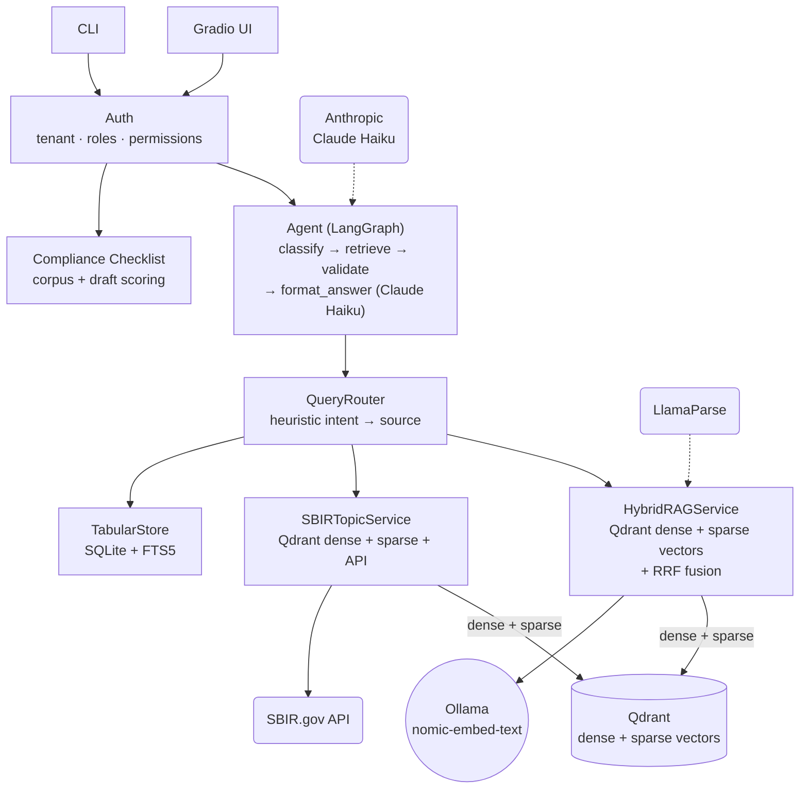

# GovGrant AI


**A compliance assistant for U.S. federal SBIR/STTR grant proposals.**

GovGrant AI answers questions about agency regulations (DoD/DARPA, SBA, NIH SF424) using multimodal RAG over text, tables, and figures, orchestrated by a LangGraph agent with Claude Haiku. It also runs compliance checklists against the source corpus and scores proposal drafts against each agency's requirements.

[Architecture](#architecture) · [Quick start](#quick-start) · [Project layout](#project-layout) · [Quality gates](#quality-gates) · [Auth & multi-tenancy](#dev-auth--multi-tenant)

---

## Architecture



### Why hybrid RAG (dense + sparse + multimodal)

SBIR/STTR compliance documents mix two search modes that no single retriever handles well:

| Mode | Example query | Solved by |
|---|---|---|
| Semantic | "What does the work-share policy say?" | Dense vectors — meaning, synonyms, paraphrase |
| Lexical | `2 CFR 200`, `SF-424`, `40%`, `5500.7` | Sparse vectors (native Qdrant) — guaranteed recall on codes and clauses |
| Multimodal | Tables, figures, flowcharts | Modality-specific parser and indexing path |

### Why an agent (LangGraph)

Plain RAG can't orchestrate multi-step decisions. The agent structures every response:

1. **classify** — greeting? document / table / SBIR.gov query?
2. **retrieve** — hybrid RAG + neighbor page expansion + force-include pages with exact phrase matches
3. **validate** — short-circuits if evidence is insufficient (no LLM call wasted)
4. **format_answer** — Claude Haiku synthesizes an answer grounded in the retrieved evidence

Without an agent, there's no reliable way to combine SBIR.gov data, milestone tables, and DARPA instructions in a single answer without hallucinating.

### Why LlamaIndex + LangGraph

- **LlamaIndex** handles data orchestration out of the box: hierarchical chunking (`HierarchicalNodeParser`), `QdrantVectorStore` with native hybrid mode, and ingestion into Qdrant in a few lines — replacing what would otherwise be ~400 lines of boilerplate.
- **LangGraph** models the flow as an explicit `StateGraph` with typed shared state rather than a linear chain. Each node (`classify`, `retrieve`, `validate`, `format_answer`) is independently testable, and `validate` short-circuits with no LLM call when evidence is missing. The alternative (LangChain Expression Language) is more verbose for the same graph.

## Data sources

The `QueryRouter` doesn't send every query to the vector store — it picks between three distinct sources depending on intent:

| Source | Backing store | What it covers |
|---|---|---|
| `HybridRAGService` | Qdrant (dense + sparse vectors) | Agency policy/regulation text, tables, and figures — the indexed document corpus |
| `TabularStore` | SQLite + FTS5 | Structured tabular data with exact lexical search, outside the vector index |
| `SBIRTopicService` | Qdrant (dense + sparse) **+ live SBIR.gov API** | SBIR/STTR topics and open funding opportunities, combining its own index with real-time external calls |

In short: two of the three paths sit outside the main vector DB, and one of those (`SBIRTopicService`) also reaches out to a live external API rather than relying solely on indexed data.

## Quick start

```bash
python -m venv .venv && source .venv/bin/activate
pip install -e ".[dev]"
cp .env.example .env   # set ANTHROPIC_API_KEY, LLAMAPARSE_API_KEY, Ollama/Qdrant URLs

# Ingest fixture PDFs (Qdrant + Ollama must be running)
python -m govgrant.rag.cli ingest

# Chat UI (session API key shared across tabs)
python -m govgrant.ui.app
# → http://127.0.0.1:7860
# Set the session key once — Chat / My proposals / Checklist all share the same tenant

# Golden eval (run after ingest)
python -m govgrant.rag.cli eval --golden

# Compliance checklist (corpus, or against a draft PDF)
python -m govgrant.rag.cli checklist --package darpa --ot
python -m govgrant.rag.cli checklist --draft-pdf ./proposal.pdf --llm-draft --package darpa --ot
python -m govgrant.rag.cli checklist --package darpa --ot --export   # writes md+json to data/eval/reports/ (gitignored)
```

## Project layout

```
src/govgrant/
  rag/          # ingest, hybrid index, router, eval, CLI
  agent/        # LangGraph + Haiku
  compliance/   # multi-agency checklist + proposal PDF + draft LLM judge
  ui/           # Gradio console
data/eval/      # golden cases (01–10) + SCHEMA.json
tests/rag/      # unit tests
```

## Quality gates

Thresholds are versioned in `data/eval/THRESHOLDS.json`. Reports are written to `data/eval/reports/` (gitignored).

| Gate | Command | Target |
|---|---|---|
| Unit | `pytest -q tests/rag` | pass |
| Router | `python -m govgrant.rag.cli gate router` | see `THRESHOLDS.json` |
| Hard LLM | `python -m govgrant.rag.cli gate hard_llm` | pre-release |
| Checklist corpus | `./scripts/run_gates.sh checklist_corpus` | DARPA critical corpus |

```bash
./scripts/run_gates.sh unit              # pytest
./scripts/run_gates.sh router            # golden + thresholds (needs stack)
./scripts/run_gates.sh hard_llm          # agent + Haiku, multi_hop/not_found
./scripts/run_gates.sh checklist_corpus  # DARPA critical corpus
python -m govgrant.rag.cli gate --list
```

## Dev auth / multi-tenant

Default mode is open and local (`AUTH_ENABLED=false`, tenant `local-dev`).

```bash
# Enable API-key → tenant binding (see data/auth/tenants.example.json)
export AUTH_ENABLED=true
# optional: cp data/auth/tenants.example.json data/auth/tenants.local.json

python -m govgrant.rag.cli agent "What is SBIR work-share?" --api-key dev-local-key
python -m govgrant.rag.cli query "cost volume" --api-key demo-beta-key --doc-id darpa-sbir-sttr-phase-II-instructions
```

- **Public agency docs** are listed in `public_doc_ids` and readable by all tenants.
- **User proposals** are registered under the caller's `tenant_id` (UI tab **My proposals**).
- `allowed_doc_ids: []` on a tenant restricts access to non-public docs (cross-tenant isolation).

```bash
# Programmatic upload (no Gradio)
python - <<'PY'
from govgrant.auth import resolve_request_auth
from govgrant.proposals import ProposalService

auth = resolve_request_auth(api_key="dev-local-key")  # or AUTH_ENABLED=false
svc = ProposalService()
print(svc.upload(auth, "path/to/proposal.pdf", index=True).to_dict())
print([r.doc_id for r in svc.list_proposals(auth)])
svc.delete(auth, "user-proposal-…")  # also purges Qdrant + page index + tables
PY

# CLI equivalents
python -m govgrant.rag.cli proposals whoami
python -m govgrant.rag.cli proposals list
python -m govgrant.rag.cli proposals upload ./proposal.pdf
python -m govgrant.rag.cli proposals get user-proposal-my-file
python -m govgrant.rag.cli proposals delete user-proposal-my-file
python -m govgrant.rag.cli proposals audit --limit 20
```

- **Capabilities** (session banner / `whoami`): `upload_proposals`, `delete_proposals` (admin, when `AUTH_ENABLED`), `run_checklist`.
- **Audit log**: upload / delete / delete_denied events per tenant (`proposals audit`).

Deleting a proposal removes the registry entry, the file, and all index data — Qdrant vectors filtered by `tenant_id` + `gg_doc_id`, plus the page index and tabular rows.

## Branching

- `main` — stable baseline
- `develop` — active feature integration

## License

See [LICENSE](LICENSE).